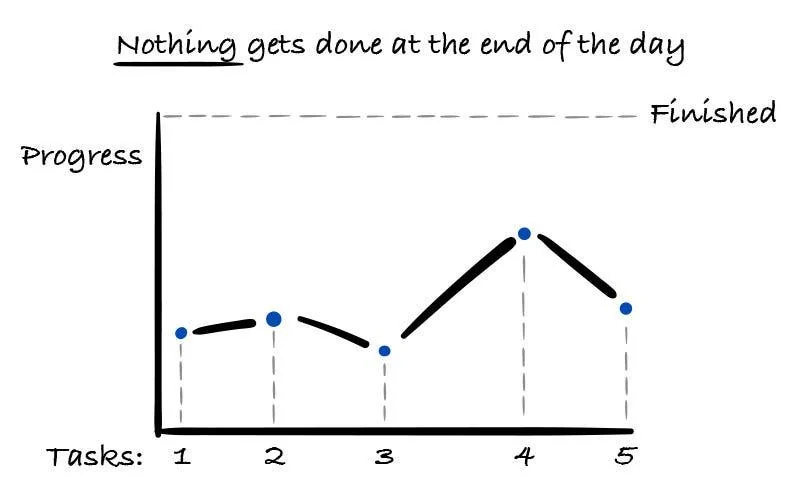
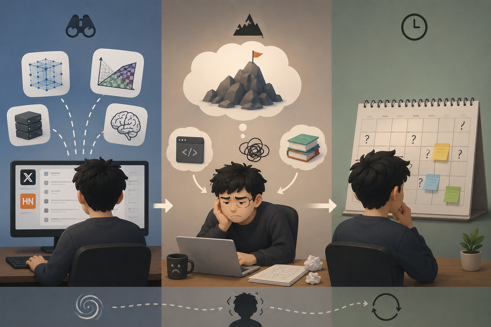
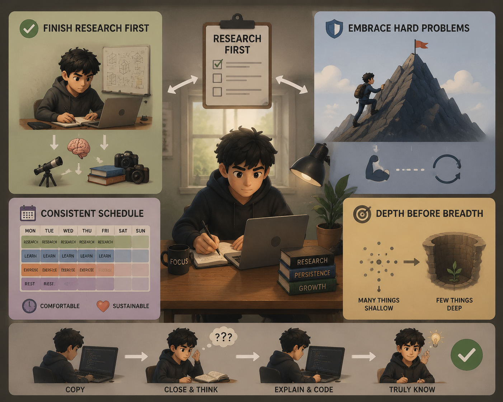

***Context switching*** is a term I learned from ChatGPT today. It means frequently changing the background of your thinking—for example, working on KV cache one hour, then starting to learn model compression the next. When someone tries to learn many things in a short period, they must keep rebuilding their mental context around the current topic.

This description feels painfully familiar to me, and I think it is bad for deep thinking.

After googling the term, I realized that context switching is not new. In simple terms, it is the process of shifting your attention from one task to another: your brain has to pause, reorient itself, and remember where it left off. It happens to me constantly, so I often feel super busy while learning almost nothing deeply.

  
  <figcaption>Low outcomes caused by too much context switching.</figcaption>

The figure captures the problem perfectly: if I keep switching, nothing gets finished.

## Why do I keep context switching?

I think there are several reasons.

1. **Too many interests.** My main research area is computer vision, but I also enjoy MLSys, graphics, and even cognitive science. When I browse social media such as X or Hacker News, I find far too many things that interest me. One exciting topic leads to another, and then context switching happens!

2. **Avoiding hard problems.** As a PhD student, my primary job is conducting research. However, as we all know, research is full of crap and frustration most of the time. When I get stuck, I sometimes start learning or doing another technical thing to escape the frustration created by my main research. I deliberately choose something that still looks technical because it lets me tell myself, “I am not wasting my time!”

3. **An inconsistent schedule.** I do not have a consistent schedule for my life, so it is easy to convince myself that *now* is the “right” time to do some extensive reading or explore a new topic. Without a clear boundary between focused research and open-ended learning, everything competes for my attention.

  
  <figcaption>Me from ChatGPT’s perspective: curious, overwhelmed, and unsure what deserves sustained attention.</figcaption>

## How can I save myself from context switching?

Let me address the causes point by point.

1. **Finish my main work before exploring.** It is okay—even great—to have a wide range of interests. However, I should guarantee that my main job is finished first. In simple terms: finish my research work, then explore anything I am curious about in my spare time. Please do not stop thinking about a research problem simply because it becomes difficult. During planned research time, do pure research work.

2. **Stop using other technical work to escape hard problems.** Avoiding hard problems is a terrible habit. If a problem were easy, the research would probably already have been done, right? I need to keep improving my mental strength and accept that failure happens most of the time. This is real ***RESEARCH*** life!

3. **Build a consistent—but comfortable—schedule.** I believe a healthy, consistent schedule would benefit both my research and my physical health, not only during my PhD journey but throughout my life. I should reserve fixed periods for focused research, separate periods for extra learning, and enough time for exercise and rest.

   By the way, I think it would be hard—nearly impossible—for me to maintain a very dense schedule. I have tried many times and failed every time! The schedule has to be comfortable and sustainable enough to follow.

## One more thing: depth before breadth

Only when we understand something deeply enough can we honestly say that we “know” it. I may learn `N` new things, then forget `N - 1`—or even all `N`—the following week. That happens because my understanding was never deep enough.

For example, suppose you can write a neural network in PyTorch only by copying code displayed beside your VS Code window. That does not necessarily mean you know how to use PyTorch; perhaps you have only memorized or copied the code. Instead, close the reference code and AI tools. Try to explain the idea to yourself, then write the code on your own.

Before rushing toward the next exciting thing, make sure you have truly mastered the current one.

  
  <figcaption>My plan, summarized by ChatGPT: finish research first, embrace hard problems, build a consistent schedule, and choose depth before breadth.</figcaption>

Okay, that is all. Let’s see whether I can overcome context switching over the next several months.
