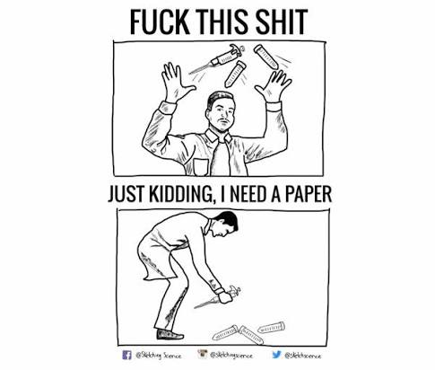

As a junior PhD student, I begin every project hoping to produce work that is both impactful and fruitful. Yet when it is time to write the paper and prepare a submission to a prestigious conference, I often find myself disappointed and frustrated. Why does this cycle repeat itself? Is it simply because I failed to learn from the last time? I am writing this note as an attempt to understand the pattern.

## The search for a convincing project

About 80 percent of the time, I feel that my research is meaningless and makes no real contribution to the community. I therefore keep searching for projects that are motivating enough for me to genuinely believe in them. Often, I think I should work on hot research topics such as LLMs, diffusion models, or agents. Yet I usually end up concluding that these are not realistic options for me, for several reasons:

1. I do not have enough computing resources—GPUs, in other words. Would I really try to train a generative model from scratch on two RTX 4090s?
2. I do not have the research speed or accumulated advantages to compete with the field's "old money." Would I really try to compete with Tri Dao on something like FlashAttention?
3. I lack consistency. I want a more coherent goal for my PhD research, but that goal keeps changing.
4. Sometimes I simply do not like a topic, no matter how hot or attractive it is. Take embodied AI: everyone is talking about it, and I believe in its potential, but I just do not find it personally exciting. Forgive my bias.
5. I lack the necessary hardware, and I do not enjoy running complex real-world experiments. I felt this struggle clearly while working on optical-tolerance projects.

For some combination of these reasons, I sometimes come to dislike my research and struggle to find any meaning in it. When that happens, I stop writing and simply wait.

## A painful streak in my research journey

Today I received the reviews for my NeurIPS 2026 submission. The initial ratings are:

- 2 (Reject)
- 3 (Borderline reject)
- 2 (Reject)

At this point, I expect the final decision to be a **rejection**. Another miserable day in my research journey, lol. Since shifting my research focus from _optical computing_ to _computer vision_, I have accumulated the following sequence of rejections:

> 1. _Tolerance Optics_ — rejected by CVPR 2025.
> 2. _Tolerance Optics_ — rejected by ICCP 2025.
> 3. _Event3D_ — rejected by CVPR 2026.
> 4. _Event3D_ — withdrawn from ECCV 2026 after receiving no positive ratings.
> 5. _Event3D_ — likely to be withdrawn from NeurIPS 2026 after receiving no positive ratings.

If NeurIPS ends as I expect, it will mark five consecutive unsuccessful submissions, and the streak may continue. Put differently, I have not had a paper accepted at a so-called top-tier computer vision conference in two years—nearly three.

To be honest, I know many other PhD and master's students who have published more than five papers at top-tier conferences. Comparing myself with them puts me under enormous pressure and makes me anxious. Sometimes I feel so depressed that I begin to wonder whether I am qualified to be a PhD student at all. **More importantly, I no longer find much joy or fun in research**.

These past and ongoing failures also cause enormous emotional fluctuations in my current projects. Several recurring thoughts come to mind:

1. "I should do research as quickly as possible, even if the result is a trash paper. At least I would have more publications. If I submit enough papers, some of them will be _accepted_ by chance, right?"
2. "I am really bad at research. I should quit research—and perhaps my PhD."
3. "I am a much worse PhD student than all those excellent students around me."
4. "I should produce better work in every respect—_writing_, _figures_, _rebuttals_, everything."
5. "I am embarrassed that I have been rejected by so many conferences and have so few research outcomes."
6. "I increasingly expect my current projects to be rejected as well, simply because I am the one conducting them."

The list feels endless. Yet most of these thoughts are negative and offer nothing useful for the rest of my research journey. Worse, they directly harm my ongoing projects. Sometimes I stop working on research for days—or even months.

  
  <figcaption>Exactly Me - A Fucked PhD</figcaption>

## Why continue?

So, what should I do next—leave my PhD program, or keep suffering, keep improving, and believe that the next paper might be accepted? Before choosing, I need to return to a more basic question: why did I decide to pursue a PhD in computer vision in the first place? After thinking about it deeply and honestly, I can identify several motivations:

1. A PhD in computer vision—or simply having a doctorate—feels cool. After all, I would get to put "Dr." before my name.
2. A PhD could help me enter industry from a stronger position. For example, I might qualify for a Research Scientist role rather than a Research Engineer role.
3. I might be able to stay in academia and eventually become a professor.
4. A PhD aligns with my broader life goal: remain curious, keep learning, and contribute to one of the most important technologies of our time—AI. There will always be time to find a job and make money, but perhaps only a limited window in which to begin a PhD.
5. I genuinely enjoy the magic of computer vision and graphics, from computational photography to rendering. Their demos fascinate me, and I want to create some of that magic myself.

If I leave my PhD program, I might no longer have to suffer through conference rejections. But I would also have to begin a job that, based on my brief internship at Alibaba, I might find somewhat boring. Industry work did not feel as creative to me as doing a PhD. So I still seem to have enough motivation to keep pursuing the degree.

Okay, then I should continue improving my research skills and learn how to reduce the chance of rejection. But how can I make the process feel more manageable—and perhaps even enjoyable?
