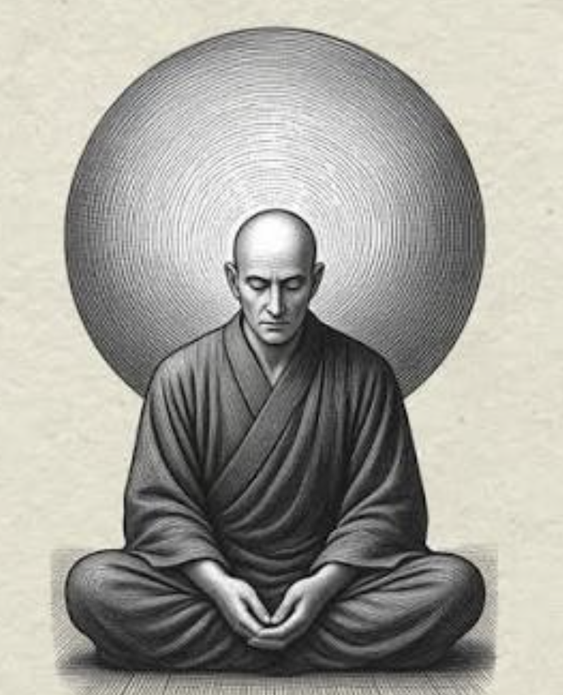

Happy mode is the most wanted mode for everyone's life. For me, life kinds of becoming struggling and I suddenly find a very inspiring and interesting blog: [Ten Steps Towards Happiness](http://hintjens.com/blog:99). There are ten steps towards happy mode, some of the steps, I can't agree more.

## Doing things you are bad at and keep suffering
How to get happy? A very counterintuitive answer is keep you are "painful", actually, are learning new things. We may think doing things we are really good at will be easier and more comfortable, however, you will not get long-term happy and sense of achievement from these things, just like spending a lot of time on social media. For this point, I just can't agree more, for me, I think the keep myself learning something new will be "painful" temporally, but get huge, huge happiness if I finnaly master it and I will feel not waste my lifetime.

  
  <figcaption>The Life of Zen - Keep Calm and Suffer</figcaption>

