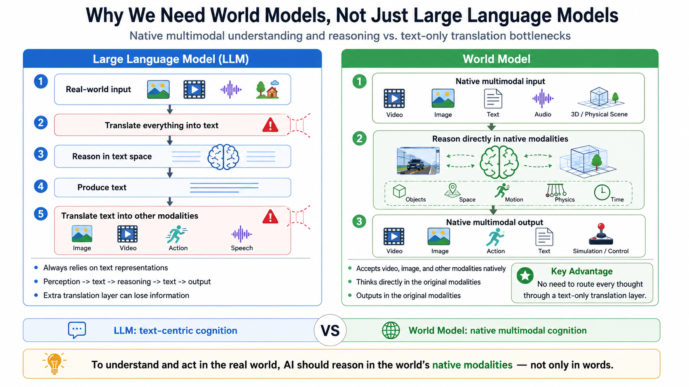
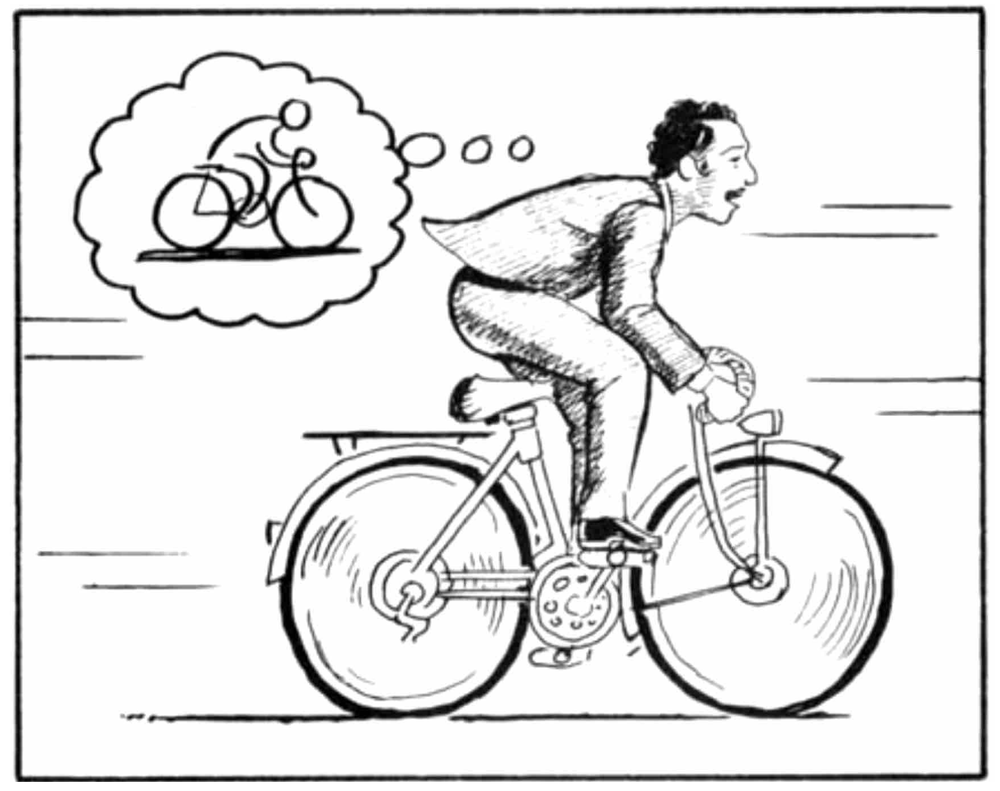

> I wrote this blog to summarize the concept of world models for myself. I hope it will help me build a meaningful roadmap for my PhD journey.

## The many definitions of a world model

Before asking what a world model is, I think it is useful to ask another important question: **Why are we still not satisfied with current AI models, such as LLMs and MLLMs?**

LLMs—and even AI agents—have demonstrated impressive intelligence. They can outperform humans in certain tasks, including coding and writing documents or papers. So why do we still want to push AI further?

One answer is that most current AI models still operate primarily in the digital world. They can generate text, code, images, and videos, but they cannot directly help us cook a meal or move an object in the physical world. [Artificial intelligence](https://en.wikipedia.org/wiki/Artificial_intelligence) is generally understood as the ability of computational systems to perform tasks associated with human intelligence, including learning, reasoning, problem-solving, perception, and decision-making. For me, this definition points toward something important: intelligence should eventually be able to perceive and affect the real world.

I find it interesting to think of **the real world as the final benchmark for every kind of intelligence**. In my mind, AI algorithms from both computer vision and natural language processing should ultimately be tested through real-world scenarios. We describe human beings as intelligent because we can make decisions and take actions according to the state of the world around us—not only inside a digital or virtual environment.

From this perspective, there are several reasons to pursue intelligence that works in the real world:

- We want to connect AI to the real world, test it there, and let it create a meaningful impact there.
- We want a general AI model that can predict and interact with the real world, rather than a collection of isolated experts for depth estimation, optical flow, action prediction, and every other individual task. For example, we hope to build a robot that can drive like a human instead of simply combining many disconnected models.
- We have an enormous amount of unstructured visual data, especially video. We want to understand whether a general AI model can emerge from these simple but abundant observations.

*A world model aims to reason in the native modalities of the physical world and connect perception, prediction, and action.*

## Why are there so many definitions?

As mentioned above, we need AI systems that can connect to the real world and complete a loop from **prediction to action**. Many research communities are closely connected to this goal, including 3D vision, robotics, computer graphics and physical simulation, embodied AI, multimodal language models, and video generation.

Because researchers come from different backgrounds, each community naturally develops its own definition of a world model. I like this diversity because it suggests that the field is blooming. I want to understand world models from these different perspectives instead of forcing them into a single narrow definition.

At the same time, I do not think world models will fully replace LLMs. Instead, I believe world models and LLMs will become two coherent and complementary parts of a higher level of AI.

*An internal world model, illustrated in Scott McCloud's Understanding Comics.*

### The perspective from 3D vision

3D vision may be the most straightforward perspective on world models. For many people, the word *world* itself is strongly connected to three-dimensional space.

3D vision focuses on topics such as 3D reconstruction and generation, which can give people an immersive feeling of entering a new digital world. More and more 3D vision papers now describe their work as world modeling. In my opinion, however, many of these papers still focus mainly on reconstructing or generating a 3D environment.

From this perspective, the goal of world modeling is to provide a faithful and consistent digital 3D world that an agent can explore.

## Inspiring resources about world models

1. [Embodied Intelligence Through World Models](https://utoronto.scholaris.ca/server/api/core/bitstreams/8a278445-a1ce-4a53-9275-4f1a0c6739b9/content#page=17.10), by Danijar Hafner
2. [The Workshop on World Models](https://world-model-mila.github.io/), Mila
3. [Critiques of World Models](https://arxiv.org/pdf/2507.05169), by Eric Xing

## Reference

- Scott McCloud, [*Understanding Comics: The Invisible Art*](https://en.wikipedia.org/wiki/Understanding_Comics) (1993)
