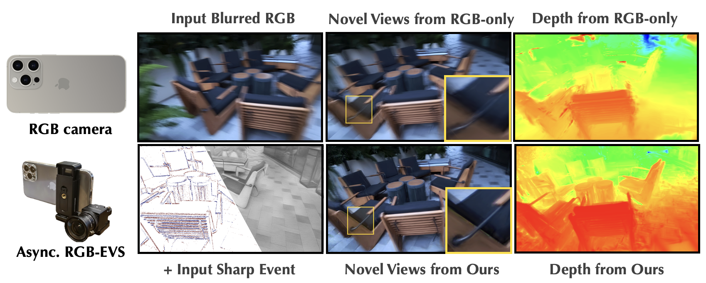

3D Gaussian Splatting and NeRF produce stunning photorealistic reconstructions, but they assume one thing: sharp, high-quality input images. Pick up a camera, walk around a scene, and shoot handheld—motion blur creeps in, and the reconstruction falls apart. Deblurring algorithms help, but severe blur from fast motion or long exposures still breaks them. Event cameras, with their microsecond temporal resolution, seem like the perfect solution. Yet existing event-assisted methods are stuck with low-resolution sensors and strict hardware synchronization requirements that are simply unavailable on everyday devices.

We asked: can event cameras deblur 3D reconstructions from common, unsynchronized handheld devices?

## The central question

Most people do not own a DAVIS sensor. They own a smartphone, a RealSense, or a mirrorless camera—none of which provide hardware-level synchronization with an event camera. If event-assisted 3D reconstruction is ever going to be practical, it must work with off-the-shelf RGB cameras and a separately mounted event sensor, with no synchronization beyond a shared rigid bracket.

Our answer is AsyncEvGS: a pipeline that pairs a 1280×720 Prophesee event camera with an iPhone 13 RGB camera, feeds both into a Visual Geometry Transformer for cross-domain pose estimation, and optimizes a 3D Gaussian Splatting representation with a suite of purpose-built losses.

  
  <figcaption>High-quality 3D reconstruction from severely blurred handheld inputs</figcaption>

## Why existing methods fall short

There are two families of approaches, and both have problems.

**RGB-only deblurring 3D reconstruction** methods (BAD-Gaussians, BAGS, Deblurring 3DGS, CRiM-GS) jointly optimize the 3D representation and the exposure trajectory. They synthesize blurred renderings by integrating sharp latent images over time, then supervise against the captured blurry frame. The trouble is that deblurring is fundamentally ill-posed—without external motion cues, the optimizer can land on a plausible-looking but geometrically wrong solution, especially under large blur.

**Event-assisted methods** (E2NeRF, Ev-DeblurNeRF, EvaGaussians, LSENeRF) use the event stream as a high-temporal-resolution motion prior. This is much better in principle, but every existing method either uses a low-resolution DAVIS sensor (346×260) or requires rigid hardware synchronization between the RGB and event cameras. LSENeRF is the only prior work at 1280×720, and it demands meticulous pre-calibration and synchronized triggers.

> No prior method simultaneously achieves high resolution and freedom from hardware synchronization. That is the gap we target.

## How AsyncEvGS works

The pipeline has two stages.

**Stage 1 — Cross-domain initialization.** Raw event streams are converted to sharp grayscale images via E2VID, then cleaned up with bilateral denoising and multi-frame brightness equalization. Both the blurred RGB frames and the reconstructed event frames are fed into VGGT (Visual Geometry Transformer), which jointly estimates camera poses and produces a dense point cloud for 3DGS initialization. Unlike COLMAP—which routinely fails on blurred frames, with registration rates as low as 36%—VGGT achieves 100% registration on both modalities.

**Stage 2 — Specialized optimization.** We train a 3D Gaussian Splatting model with five loss terms:

1. A **blur synthesis loss** that renders N sharp views per frame and averages them to match the captured blurry input;
2. An **event structure loss** that extracts high-frequency structural information from event-reconstructed frames and enforces SSIM-based consistency, deliberately excluding the luminance channel to avoid brightness mismatch between RGB and grayscale event data;
3. A **pose refinement loss** for fine-tuning the initial VGGT poses;
4. **RGB consistency regularization** that prevents the deblurred renderings from drifting away from the observed input;
5. **Event consistency regularization** that anchors rendered colors to a coarse RGB-only 3DGS reference model, preventing appearance collapse during joint optimization.

The regularization terms are critical. Without them, the jointly ill-posed deblurring and event losses drive the optimization toward degenerate solutions—sharp-looking but geometrically or photometrically wrong.

## What we found

On our real-world **AsyncEv-Deblur dataset** (7 scenes, 1280×720, captured under normal outdoor lighting with standard exposure times), AsyncEvGS achieves a PSNR of 26.00, compared to 24.69 for an adapted LSENeRF and 24.04 for BAGS. On synthetic Ev-DeblurBlender data, the gap is larger: 22.99 PSNR vs. 21.26 for LSENeRF.

| Dataset | 3DGS | BAGS | DeblurringGS | LSENeRF* | **Ours** |
|---|---|---|---|---|---|
| Ev-DeblurBlender (PSNR) | 17.82 | 20.38 | 19.28 | 21.26 | **22.99** |
| AsyncEv-Deblur (PSNR) | 22.69 | 24.04 | 23.81 | 24.69 | **26.00** |

Ablation studies confirm that every component matters: removing the event structure loss drops PSNR by 0.73 dB; removing RGB consistency regularization drops it by 0.66 dB; removing event consistency regularization drops it by 0.21 dB. The VGGT initialization alone provides a 1.73 dB gain over COLMAP.

Perhaps most importantly, the system is flexible: it works even when the RGB and event cameras run at mismatched resolutions, and it requires no synchronization beyond a simple rigid bracket.

<h2 id="paper">Paper</h2>

The full paper is available on arXiv ([2605.07192](https://arxiv.org/abs/2605.07192)). It includes detailed descriptions of the event structure loss formulation, the consistency regularization framework, the deblurring MLP architecture, the AsyncEv-Deblur dataset, and extended ablation studies.

<h2 id="materials">Materials</h2>

- [Project page](https://openimaginglab.github.io/AsyncEvGS/) with visual results and comparisons
- [Code](https://github.com/OpenImagingLab/AsyncEvGS) — built on the Gsplat framework with Deblurring 3DGS's RGB deblurring module
- [AsyncEv-Deblur dataset](https://openimaginglab.github.io/AsyncEvGS/) — 7 real-world scenes at 1280×720, captured with the asynchronous RGB-Event rig
- [arXiv preprint](https://arxiv.org/pdf/2605.07192)
