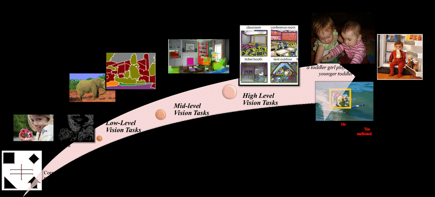

I am interested in computer vision, and nearly everyone working in the field seems to share the same broad goal: enabling machines to see and understand the real world as humans do. To make this ambitious goal tractable, researchers have decomposed it into many smaller problems. This is why computer vision now contains such a wide range of subfields and topics.

I am often struck by the sheer number of directions in the field: classification, detection, reconstruction, understanding, and many more. Some become intensely popular for a time, while others gradually fade. Looking across this landscape raises several fundamental questions for me.

1. Why did we divide the field in this particular way? Although the intention was to turn an ultimate objective into a sequence of incremental milestones, what was the basis for these specific divisions? Why was the roadmap designed this way? For example, why did reconstruction emerge as a major milestone before vision-language models or broader visual understanding? What shaped the evolutionary path that the field has taken?
2. We divided the problem into many smaller subfields so that machines might eventually see and understand the world as humans do. But once a problem has been decomposed, does solving and reassembling all its parts necessarily recover the original goal? Will solving every so-called subproblem actually add up to visual intelligence? I am finding this increasingly difficult to see. My current impression is that some tasks still offer a promising route toward that goal, while others may no longer contribute much to it.
3. How far are we from our ultimate goal? More importantly, how should we define true visual intelligence? What does it mean for a machine—or even for a human—to truly see? Under what conditions would we consider a machine capable not merely of seeing, but of perceiving and understanding the world?

  
  <figcaption>Different levels of computer vision tasks</figcaption>

_Content Loading..._