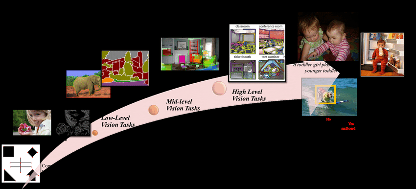
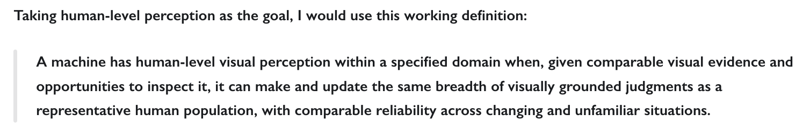
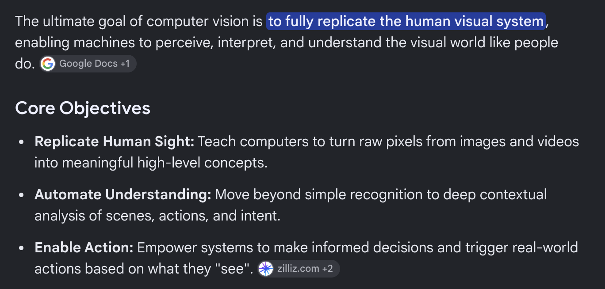
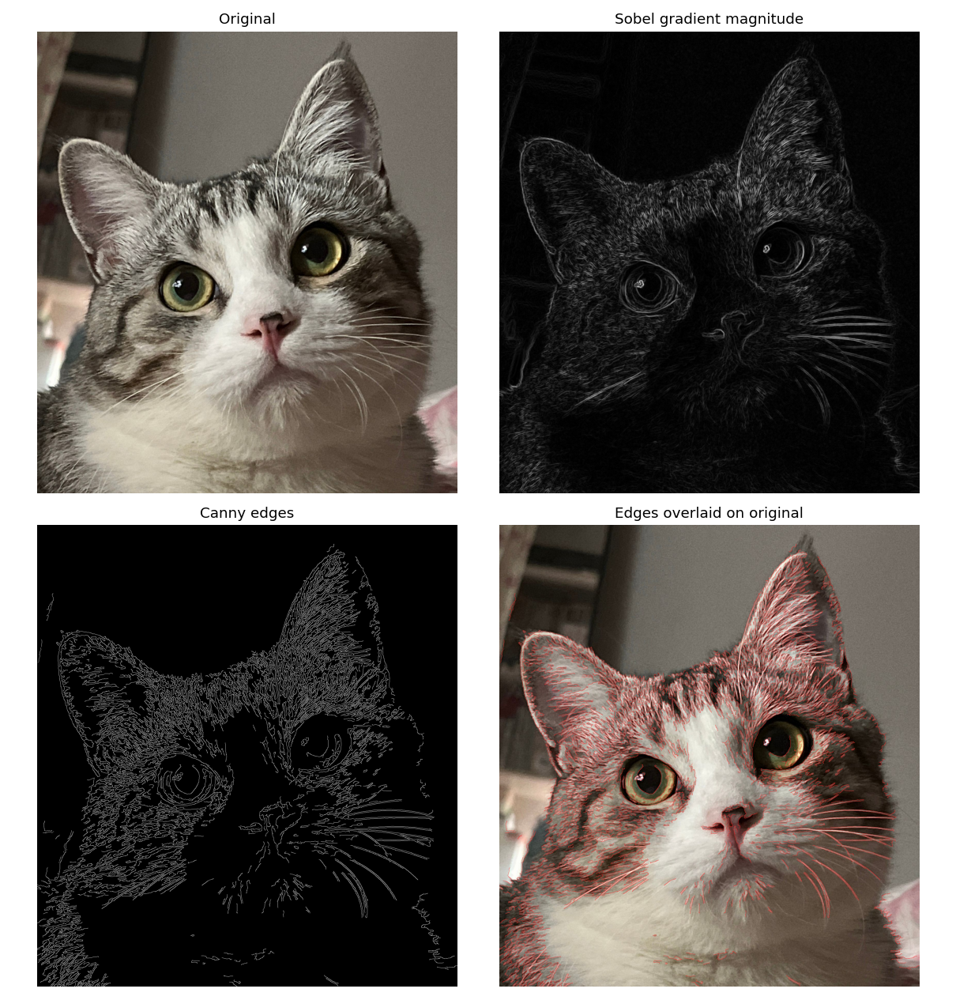

_Last updated: September 27, 2026 · An evolving research note._

I am interested in computer vision, and a broad ambition has always drawn me to the field: enabling machines to see and understand the real world as humans do. To make this ambition tractable, researchers have decomposed it into smaller problems. Classification, detection, reconstruction, and many other tasks each capture something we would like a visual system to do.

Yet I am often struck by the sheer number of directions in the field. Some become intensely popular for a time, while others gradually fade. Looking across this landscape, I keep returning to three questions:

1. **Why did we divide the field in this particular way?** If these tasks are intended as milestones toward a larger objective, what determined the milestones? Why did geometric reconstruction become an established research direction long before today's vision-language models? How much of this path reflects the nature of vision, and how much reflects the tools, data, and evaluation methods available at the time?
2. **Does solving the parts recover the whole?** We decomposed the problem to make progress, but does solving and reassembling every subproblem necessarily produce visual intelligence? I find that connection increasingly difficult to take for granted. Some directions seem closely tied to the larger goal; for others, I struggle to see how another improvement brings us closer.
3. **How would we know how far we have come?** What does it mean for a machine—or even a human—to truly see? Under what conditions would we say that a system perceives and understands the world?

<figure>
  
  <figcaption>Different levels of computer vision tasks. How do these pieces connect to the larger goal?</figcaption>
</figure>

These questions feel especially timely as I restart my PhD at HKU. I am deciding what to work on over the next three to four years. I think of myself as a computer vision researcher, so the personal question is also a research question: **what is the next problem in computer vision that I should devote myself to?**

Before choosing another subproblem, I want to understand the goal it is supposed to serve. This note begins with the third question above: what are we trying to achieve, and how might we evaluate progress toward it? I do not yet have a complete answer.

## What do we mean by “seeing like a human”?

The familiar description of computer vision—teaching machines to see and perceive like humans—sounds clear until we ask what it actually requires. I am fairly sure it means more than classification, detection, or 3D reconstruction alone. But what, exactly, is missing?

As a starting point, I asked GPT-6 Astra Pro for a definition of human-level visual perception:

<figure>
  
  <figcaption>A working definition proposed by GPT-6 Astra Pro in my conversation on September 27, 2026.</figcaption>
</figure>

The answer gives me useful language, particularly its emphasis on unfamiliar situations, but I still find it difficult to turn into a concrete research target. What counts as the same breadth of judgment? Which situations should we test? How would we know that we had covered enough of them?

A Google search led me back to a similarly broad formulation:

<figure>
  
  <figcaption>A search summary I encountered while exploring the question. It illustrates the familiar framing, rather than establishing a settled definition.</figcaption>
</figure>

For me, these descriptions leave two recurring ideas:

- A visual system extracts useful information from inputs such as RGB images or depth measurements.
- That information supports some further judgment, decision, or action.

This is a useful starting point. It also leaves a crucial word unexplained: **useful for what?**

## From extracting features to solving tasks

Separating those two ideas gives us an *extract-then-task* pipeline: first obtain a representation, then use it to solve a problem. In a classical recognition pipeline, for example, we might design features based on image gradients and train a statistical classifier, such as an SVM, on those features.

The appeal is clear. Each stage has a defined responsibility, and each can be studied on its own. But I do not experience recognizing a friend as first constructing an edge map and then classifying it. Recognition feels like a continuous act of perception.

<figure>
  
  <figcaption>Edges and gradients expose useful image structure. When I recognize what I see, however, I am not consciously inspecting an edge map.</figcaption>
</figure>

That intuition draws me toward end-to-end learning, where representations are learned together with the task instead of being entirely specified by hand. Still, I should be careful about the analogy: the fact that I do not consciously see intermediate features tells me little about how my brain computes them. Nor does training a model end to end establish that it works like a human visual system. My interest is in allowing the task to shape the representation, rather than assuming in advance that I know every intermediate quantity it needs.

There is also a hierarchy hidden inside this pipeline. Edge detection can be a task in its own right, with operators such as Sobel as one way of approaching it. Its output can then become an input to another task. A representation that is the final product at one level becomes an intermediate step at the next.

This resembles a familiar habit in computer science: building increasingly complex systems through layers of abstraction. Computer vision gives us many possible layers:

- What objects are present?
- How are they arranged in space?
- What might happen next in this scene or video?
- What 3D structure could have produced this image?

Each question captures a meaningful capability. The difficulty is understanding whether our chosen layers are sufficient for the larger system we want to build—and whether their interfaces preserve the information that system needs.

## Do the milestones add up?

Humans are a natural reference point for these tasks. If a model matches or exceeds human performance on a particular evaluation, we have learned something about its capability under those conditions. But that does not immediately establish human-level perception in a broader sense.

What frustrates me is the gap between our detailed measurements of individual tasks and my much less clear sense of progress toward the overall goal. We can extract many kinds of information from visual data, yet we may not know which information a new task will require, or how a system should use it.

Consider reaching for a cup of water. I can usually move my hand an appropriate distance and adjust my grasp without explicitly reporting the cup's depth, pose, or geometry. Those quantities may help us describe the problem, but my experience of completing it does not reveal the representations that make it possible. For a deeper account of the human visual system, I keep returning to Brian Wandell's [*Foundations of Vision*](https://wandell.github.io/FOV-1995/), which studies vision through encoding, representation, and interpretation.

This is why I find it hard to write down a finite task list and declare that success on every item would mean the ultimate goal of computer vision had been achieved. A list makes our assumptions explicit, which is valuable. It does not guarantee that we have anticipated everything a visual system will encounter.

The possibility of foundation models makes this question even more interesting to me. A single model may be evaluated across many tasks rather than being designed for only one. That broadens the scope of evaluation, but it does not remove the underlying question: **does success across many familiar tasks imply that a system can use vision effectively in an unfamiliar situation?**

Here I want to distinguish breadth from generalization. Supporting many task types is one kind of breadth. Handling new objects, environments, instructions, and combinations of circumstances is a further demand. Impressive examples of the former do not, by themselves, settle the latter.

My current view is that there may never be one final milestone after which we can confidently declare computer vision “finished.” That does not make the existing tasks meaningless. They have practical value, and controlled evaluations help us identify specific strengths and failures. What I question is whether completing a collection of isolated tasks is sufficient evidence for the much larger claim.

## Evaluating vision as part of a whole system

If a fixed checklist cannot settle the question, perhaps we should put more weight on the requirements that motivated vision in the first place. Can a system use what it sees to accomplish something in the world?

Imagine asking a robot to go to the market, buy ingredients, return home, cook a meal, and serve it. That request combines many capabilities over a long sequence of actions. Even a much smaller request—“find the cup I mean and pass it to me”—requires perception to remain useful throughout an interaction.

For this purpose, I would learn more from watching the system complete the request under varied conditions than from seeing its classification accuracy alone. A model might recognize the correct object in an image and still fail to locate it after the scene changes, reach it, or recover from a mistaken grasp.

An end-to-end system is particularly interesting to me because it need not expose all its intermediate representations as the familiar outputs of separate vision modules. We may not immediately know which information it has learned to extract. We can still ask whether that information supports successful behavior, and investigate the representations when we need to understand a failure.

Two aspects of evaluation matter most to me:

1. **Whole-system performance.** Test whether an agent completes a task that requires visual information throughout the sequence. Recognition should contribute to finding and handing over the intended cup, rather than being evaluated only as an isolated label prediction.
2. **Generalization beyond familiar conditions.** Change the objects, layouts, lighting, instructions, or combinations of events. Does the system still succeed when the setting differs meaningfully from its training and evaluation examples?

My experience with coding agents is part of what motivates this view. A reported benchmark improvement does not always translate directly into a better experience on my own projects. I want to ask the analogous question for vision: how well does measured performance predict the behavior I actually need?

There is a complication here. A robot's success depends on planning, control, and hardware as well as vision. Whole-system evaluation brings us closer to the practical requirement, but a failed task does not automatically diagnose a visual failure. I would therefore use it alongside targeted tests that help explain what went wrong.

## Why this leads me toward world simulators

Testing long sequences of actions across many physical environments is difficult to scale. Hardware, time, cost, and repeatability all constrain the experiments we can run. This is part of why I am drawn to world models and interactive simulators.

If we could build sufficiently faithful digital environments, we could create many tasks that require an agent to perceive, act, and respond to the consequences. We could vary the setting, repeat an experiment, and inspect failures at a scale that would be difficult in the physical world.

For this purpose, visual realism alone would not be enough. The environment would also need to respond meaningfully to actions and preserve the properties that matter for the task. A convincing image of a cup is different from an environment in which the cup can be found, grasped, moved, and handed to someone. A digital twin could be useful when correspondence to a particular real environment matters; a broader simulator could let us explore many unfamiliar ones.

Simulation would not give us a final certificate of visual intelligence, either. Success in a simulator is evidence about performance under that simulator's assumptions, and its relevance to the real world would still need to be checked. But it could give us a more practical way to study how visual capabilities work together, and where they fail as conditions change.

That is the direction that currently excites me: **building world simulators in which we can generate varied, complete tasks and evaluate visual intelligence through an agent's interaction with its environment.**

I began with the question of why computer vision was divided into so many subproblems. I am now increasingly interested in how to bring those capabilities back into the situations they are meant to serve. Deconstructing the problem has helped us make progress. Reconstructing the whole may help me understand what to work on next.

_Still thinking, still updating._
